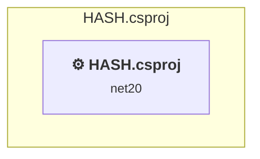

# Projects and dependencies analysis

This document provides a comprehensive overview of the projects and their dependencies in the context of upgrading to .NETCoreApp,Version=v10.0.

## Table of Contents

- [Executive Summary](#executive-Summary)
  - [Highlevel Metrics](#highlevel-metrics)
  - [Projects Compatibility](#projects-compatibility)
  - [Package Compatibility](#package-compatibility)
  - [API Compatibility](#api-compatibility)
  - [Binding Redirect Configuration](#binding-redirect-configuration)
- [Aggregate NuGet packages details](#aggregate-nuget-packages-details)
- [Top API Migration Challenges](#top-api-migration-challenges)
  - [Technologies and Features](#technologies-and-features)
  - [Most Frequent API Issues](#most-frequent-api-issues)
- [Projects Relationship Graph](#projects-relationship-graph)
- [Project Details](#project-details)

  - [HASH\HASH.csproj](#hashhashcsproj)

## Executive Summary

### Highlevel Metrics

| Metric | Count | Status |
| :--- | :---: | :--- |
| Total Projects | 1 | All require upgrade |
| Total NuGet Packages | 0 | All compatible |
| Total Code Files | 51 |  |
| Total Code Files with Incidents | 22 |  |
| Total Lines of Code | 9930 |  |
| Total Number of Issues | 3175 |  |
| Estimated LOC to modify | 3172+ | at least 31,9% of codebase |

### Projects Compatibility

| Project | Target Framework | Difficulty | Package Issues | API Issues | Binding Issues | Est. LOC Impact | Description |
| :--- | :---: | :---: | :---: | :---: | :---: | :---: | :--- |
| [HASH\HASH.csproj](#hashhashcsproj) | net20 | 🟡 Medium | 0 | 3172 | 1 | 3172+ | ClassicWinForms, Sdk Style = False |

### Package Compatibility

| Status | Count | Percentage |
| :--- | :---: | :---: |
| ✅ Compatible | 0 | 0,0% |
| ⚠️ Incompatible | 0 | 0,0% |
| 🔄 Upgrade Recommended | 0 | 0,0% |
| ***Total NuGet Packages*** | ***0*** | ***100%*** |

### API Compatibility

| Category | Count | Impact |
| :--- | :---: | :--- |
| 🔴 Binary Incompatible | 2881 | High - Require code changes |
| 🟡 Source Incompatible | 281 | Medium - Needs re-compilation and potential conflicting API error fixing |
| 🔵 Behavioral change | 10 | Low - Behavioral changes that may require testing at runtime |
| ✅ Compatible | 5509 |  |
| ***Total APIs Analyzed*** | ***8681*** |  |

### Binding Redirect Configuration

| Severity | Count | Description |
| :--- | :---: | :--- |
| 🟡Potential | 1 | May cause issues in certain scenarios |
| ***Total Binding Issues*** | ***1*** | ***Across 1 project(s)*** |

## Aggregate NuGet packages details

| Package | Current Version | Suggested Version | Projects | Description |
| :--- | :---: | :---: | :--- | :--- |

## Top API Migration Challenges

### Technologies and Features

| Technology | Issues | Percentage | Migration Path |
| :--- | :---: | :---: | :--- |
| Windows Forms | 2881 | 90,8% | Windows Forms APIs for building Windows desktop applications with traditional Forms-based UI that are available in .NET on Windows. Enable Windows Desktop support: Option 1 (Recommended): Target net9.0-windows; Option 2: Add <UseWindowsDesktop>true</UseWindowsDesktop>; Option 3 (Legacy): Use Microsoft.NET.Sdk.WindowsDesktop SDK. |
| GDI+ / System.Drawing | 281 | 8,9% | System.Drawing APIs for 2D graphics, imaging, and printing that are available via NuGet package System.Drawing.Common. Note: Not recommended for server scenarios due to Windows dependencies; consider cross-platform alternatives like SkiaSharp or ImageSharp for new code. |
| Windows Forms Legacy Controls | 3 | 0,1% | Legacy Windows Forms controls that have been removed from .NET Core/5+ including StatusBar, DataGrid, ContextMenu, MainMenu, MenuItem, and ToolBar. These controls were replaced by more modern alternatives. Use ToolStrip, MenuStrip, ContextMenuStrip, and DataGridView instead. |

### Most Frequent API Issues

| API | Count | Percentage | Category |
| :--- | :---: | :---: | :--- |
| T:System.Windows.Forms.ToolStripButton | 117 | 3,7% | Binary Incompatible |
| T:System.Windows.Forms.AnchorStyles | 107 | 3,4% | Binary Incompatible |
| T:System.Windows.Forms.Label | 88 | 2,8% | Binary Incompatible |
| T:System.Windows.Forms.TextBox | 86 | 2,7% | Binary Incompatible |
| T:System.Windows.Forms.DialogResult | 82 | 2,6% | Binary Incompatible |
| T:System.Windows.Forms.ToolStrip | 74 | 2,3% | Binary Incompatible |
| T:System.Windows.Forms.ToolStripMenuItem | 74 | 2,3% | Binary Incompatible |
| T:System.Windows.Forms.LinkLabel | 72 | 2,3% | Binary Incompatible |
| T:System.Windows.Forms.Button | 72 | 2,3% | Binary Incompatible |
| T:System.Windows.Forms.ListView | 54 | 1,7% | Binary Incompatible |
| T:System.Drawing.Font | 52 | 1,6% | Source Incompatible |
| P:System.Windows.Forms.Control.Name | 45 | 1,4% | Binary Incompatible |
| T:System.Windows.Forms.Control.ControlCollection | 41 | 1,3% | Binary Incompatible |
| P:System.Windows.Forms.Control.Controls | 41 | 1,3% | Binary Incompatible |
| M:System.Windows.Forms.Control.ControlCollection.Add(System.Windows.Forms.Control) | 39 | 1,2% | Binary Incompatible |
| P:System.Windows.Forms.Control.Size | 39 | 1,2% | Binary Incompatible |
| P:System.Windows.Forms.Control.Location | 37 | 1,2% | Binary Incompatible |
| P:System.Windows.Forms.Control.TabIndex | 35 | 1,1% | Binary Incompatible |
| T:System.Windows.Forms.ListBox | 35 | 1,1% | Binary Incompatible |
| T:System.Windows.Forms.CheckedListBox | 35 | 1,1% | Binary Incompatible |
| T:System.Drawing.FontStyle | 33 | 1,0% | Source Incompatible |
| T:System.Drawing.Bitmap | 33 | 1,0% | Source Incompatible |
| T:System.Windows.Forms.OpenFileDialog | 32 | 1,0% | Binary Incompatible |
| T:System.Windows.Forms.ColumnHeader | 30 | 0,9% | Binary Incompatible |
| T:System.Windows.Forms.PictureBox | 29 | 0,9% | Binary Incompatible |
| T:System.Windows.Forms.TabControl | 28 | 0,9% | Binary Incompatible |
| T:System.Windows.Forms.ToolStripItemDisplayStyle | 27 | 0,9% | Binary Incompatible |
| T:System.Windows.Forms.Panel | 22 | 0,7% | Binary Incompatible |
| P:System.Windows.Forms.Control.Font | 22 | 0,7% | Binary Incompatible |
| T:System.Windows.Forms.ToolStripSplitButton | 22 | 0,7% | Binary Incompatible |
| P:System.Windows.Forms.ToolStripItem.Text | 21 | 0,7% | Binary Incompatible |
| P:System.Windows.Forms.ToolStripItem.Size | 21 | 0,7% | Binary Incompatible |
| P:System.Windows.Forms.ToolStripItem.Name | 21 | 0,7% | Binary Incompatible |
| T:System.Windows.Forms.ContextMenuStrip | 21 | 0,7% | Binary Incompatible |
| T:System.Drawing.Image | 20 | 0,6% | Source Incompatible |
| T:System.Windows.Forms.AutoScaleMode | 18 | 0,6% | Binary Incompatible |
| T:System.Windows.Forms.ToolStripItemAlignment | 18 | 0,6% | Binary Incompatible |
| M:System.Windows.Forms.Control.SuspendLayout | 17 | 0,5% | Binary Incompatible |
| T:System.Windows.Forms.PropertyGrid | 17 | 0,5% | Binary Incompatible |
| E:System.Windows.Forms.ToolStripItem.Click | 16 | 0,5% | Binary Incompatible |
| T:System.Windows.Forms.ControlStyles | 16 | 0,5% | Binary Incompatible |
| P:System.Windows.Forms.DrawItemEventArgs.Bounds | 16 | 0,5% | Binary Incompatible |
| P:System.Windows.Forms.Control.Anchor | 15 | 0,5% | Binary Incompatible |
| F:System.Windows.Forms.DialogResult.OK | 15 | 0,5% | Binary Incompatible |
| T:System.Drawing.ContentAlignment | 15 | 0,5% | Source Incompatible |
| T:System.Windows.Forms.TabPage | 15 | 0,5% | Binary Incompatible |
| T:System.Windows.Forms.ComboBox | 15 | 0,5% | Binary Incompatible |
| T:System.Windows.Forms.MessageBoxButtons | 14 | 0,4% | Binary Incompatible |
| T:System.Drawing.Graphics | 14 | 0,4% | Source Incompatible |
| T:System.Drawing.GraphicsUnit | 14 | 0,4% | Source Incompatible |

## Projects Relationship Graph

Legend:
📦 SDK-style project
⚙️ Classic project

## Project Details

### HASH\HASH.csproj

#### Project Info

- **Current Target Framework:** net20
- **Proposed Target Framework:** net10.0-windows
- **SDK-style**: False
- **Project Kind:** ClassicWinForms
- **Dependencies**: 0
- **Dependants**: 0
- **Number of Files**: 60
- **Number of Files with Incidents**: 22
- **Lines of Code**: 9930
- **Estimated LOC to modify**: 3172+ (at least 31,9% of the project)

#### Dependency Graph

Legend:
📦 SDK-style project
⚙️ Classic project

### API Compatibility

| Category | Count | Impact |
| :--- | :---: | :--- |
| 🔴 Binary Incompatible | 2881 | High - Require code changes |
| 🟡 Source Incompatible | 281 | Medium - Needs re-compilation and potential conflicting API error fixing |
| 🔵 Behavioral change | 10 | Low - Behavioral changes that may require testing at runtime |
| ✅ Compatible | 5509 |  |
| ***Total APIs Analyzed*** | ***8681*** |  |

#### Binding Redirect Configuration

| Rule | Severity | Details | Recommendation |
| :--- | :---: | :--- | :--- |
| AutoGenerateBindingRedirects not set and no manual redirects | 🟡Potential | AutoGenerateBindingRedirects is not set in HASH.csproj, no manual redirects found | Explicitly enable <AutoGenerateBindingRedirects>true</AutoGenerateBindingRedirects> or add manual binding redirects. |

#### Project Technologies and Features

| Technology | Issues | Percentage | Migration Path |
| :--- | :---: | :---: | :--- |
| Windows Forms Legacy Controls | 3 | 0,1% | Legacy Windows Forms controls that have been removed from .NET Core/5+ including StatusBar, DataGrid, ContextMenu, MainMenu, MenuItem, and ToolBar. These controls were replaced by more modern alternatives. Use ToolStrip, MenuStrip, ContextMenuStrip, and DataGridView instead. |
| Windows Forms | 2881 | 90,8% | Windows Forms APIs for building Windows desktop applications with traditional Forms-based UI that are available in .NET on Windows. Enable Windows Desktop support: Option 1 (Recommended): Target net9.0-windows; Option 2: Add <UseWindowsDesktop>true</UseWindowsDesktop>; Option 3 (Legacy): Use Microsoft.NET.Sdk.WindowsDesktop SDK. |
| GDI+ / System.Drawing | 281 | 8,9% | System.Drawing APIs for 2D graphics, imaging, and printing that are available via NuGet package System.Drawing.Common. Note: Not recommended for server scenarios due to Windows dependencies; consider cross-platform alternatives like SkiaSharp or ImageSharp for new code. |

